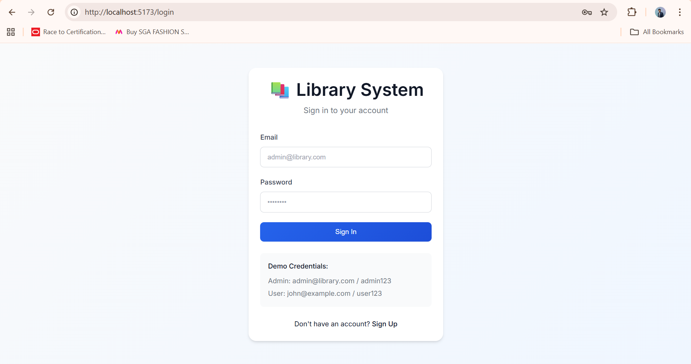
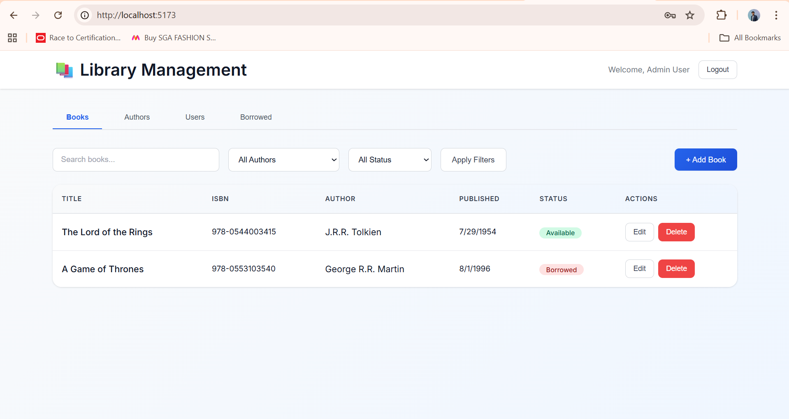
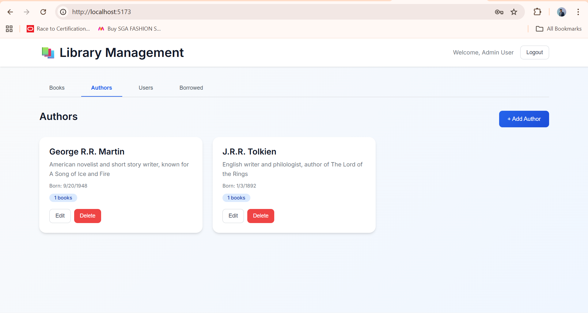
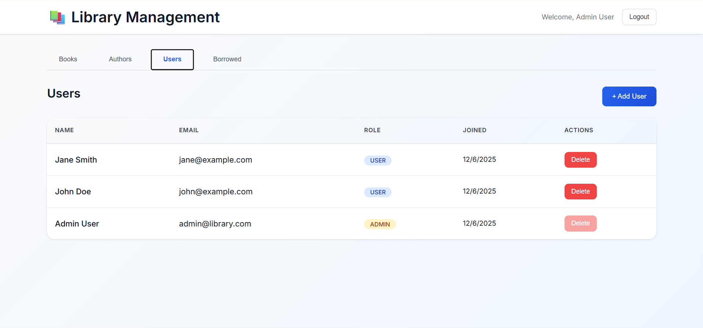
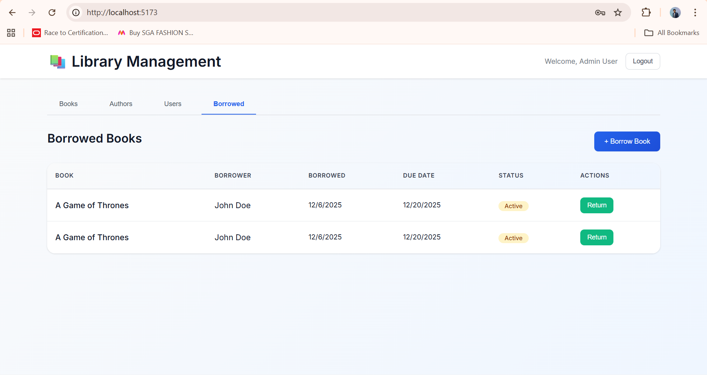

# 📚 Library Management System

A full-stack library management system built with **NestJS**, **PostgreSQL** (via Prisma), and **React** (TypeScript). This project was built to fulfill the "Full-Stack Intern Assignment".

---
## 📋 Assignment Compliance Matrix

This project was built to specifically address the requirements of the Full-Stack Intern Assignment. Below is a detailed mapping of requirements to the implementation.

| Category | Requirement | Status | Implementation Details |
|----------|-------------|:------:|------------------------|
| **Objective** | Build a full-stack library system (NestJS API + React Client) | ✅ | **Backend**: NestJS, **Frontend**: React (Vite+TS), **DB**: Postgres. |
| **Books CRUD** | Create, Read, Update, Delete, List with filters | ✅ | Implemented in \`BooksModule\`. Filters: Search, Author, Availability. Logic prevents deleting borrowed books. |
| **Authors CRUD** | Create, Read, Update, Delete, List | ✅ | Implemented in \`AuthorsModule\`. Deleting an author cascades to their books. |
| **Users CRUD** | Create, List | ✅ | Implemented in \`UsersModule\`. Users have roles (USER/ADMIN). |
| **Borrowing** | Borrow, Return, List borrowed books | ✅ | Implemented in \`BorrowedBooksModule\`. Tracks due dates and borrow status. |
| **Auth** | Simple JWT authentication | ✅ | Implemented in \`AuthModule\` using \`@nestjs/jwt\` and \`passport\`. Protected routes require a valid Bearer token. |
| **Tech Stack** | NestJS, Prisma + Postgres, React (TS) | ✅ | **Backend**: NestJS v10, Prisma v5. **Frontend**: React v18, TypeScript v5. |
| **Containerization** | Dockerfile, docker-compose | ✅ | \`docker-compose.yml\` orchestrates Backend, Frontend, and Postgres containers. |
| **Config** | Use .env with .env.example | ✅ | \`.env.example\` provided for both backend and frontend. |
| **Frontend** | Persist JWT, Manage Entities, Borrow/Return | ✅ | React Context API handles Auth state. UI supports all required operations. |
| **Bonus** | Dockerized dev environment | ✅ | Fully supported via \`docker-compose up\`. |
| **Bonus** | Advanced filtering | ✅ | Backend supports filtering by Author, Availability, and Text Search. |
| **Bonus** | Clean pixel-perfect UI | ✅ | Modern, responsive UI with gradients, shadows, and smooth transitions. |
| **Bonus** | Proper state management | ✅ | React Context API used for global Authentication state. |

---

## 🛠️ Tech Stack

### Backend
- **Framework**: [NestJS](https://nestjs.com/) (Node.js)
- **Database**: PostgreSQL 16
- **ORM**: [Prisma](https://www.prisma.io/)
- **Authentication**: JWT (JSON Web Tokens) + Bcrypt
- **Validation**: `class-validator` & `class-transformer`

### Frontend
- **Library**: [React 18](https://react.dev/)
- **Language**: TypeScript
- **Build Tool**: Vite
- **HTTP Client**: Axios
- **Routing**: React Router DOM

### DevOps
- **Docker**: Containerization for all services
- **Docker Compose**: Orchestration for local development

---

## 🖼️ Screenshots

<div align="center">
  <h3>Authentication & Security</h3>
  
  <p><em>Secure Login & Registration with JWT Authentication</em></p>
</div>

<br />

<div align="center">
  <h3>Book & Author Management</h3>
  <p>
    
    
  </p>
  <p><em>Comprehensive CRUD operations for Books and Authors</em></p>
</div>

<br />

<div align="center">
  <h3>Admin Dashboard & Borrowing</h3>
  <p>
    
    
  </p>
  <p><em>Role-Based User Management (Admin only) and Loan Tracking</em></p>
</div>

## 🏗️ Architecture & Deployment

For detailed production deployment instructions, please see [**DEPLOYMENT.md**](./DEPLOYMENT.md).

## 🚀 Quick Start

### Option 1: Using Docker (Recommended)

The easiest way to run the application is using Docker Compose. This ensures all dependencies (Database, Backend, Frontend) are set up correctly.

1.  **Clone the repository**
    ```bash
    git clone <repository-url>
    cd library-management-system
    ```

2.  **Start the application**
    ```bash
    docker-compose up -d --build
    ```
    *This command builds the images and starts the containers.*

3.  **Access the App**
    - **Frontend**: [http://localhost:5173](http://localhost:5173)
    - **Backend API**: [http://localhost:3000](http://localhost:3000)
    - **Database**: `localhost:5432`

### Option 2: Manual Setup

If you prefer to run services individually:

#### 1. Backend Setup
```bash
cd backend
npm install

# Setup Env
cp .env.example .env
# Update .env with your local Postgres credentials if needed

# Run Migrations & Seed
npm run prisma:migrate
npm run prisma:seed

# Start Server
npm run start:dev
```

#### 2. Frontend Setup
```bash
cd frontend
npm install

# Setup Env
cp .env.example .env

# Start Server
npm run dev
```

---

## 🧪 Testing & Authentication

### Default Seeded Users
The application comes with pre-seeded data for testing:

| Role | Email | Password |
|------|-------|----------|
| **Admin** | `admin@library.com` | `admin123` |
| **User** | `john@example.com` | `user123` |

### Getting a Token (curl)
To get a token manually:
```bash
curl -X POST http://localhost:3000/auth/login \
  -H "Content-Type: application/json" \
  -d '{"email": "admin@library.com", "password": "admin123"}'
```

---

## 📝 Design Decisions & Assumptions

-   **UUIDs**: Used for all primary keys to ensure scalability and avoid enumeration attacks.
-   **Soft Deletes**: Borrowed books are "returned" by setting a `returnedAt` timestamp rather than deleting the record, preserving history.
-   **Cascade**: Deleting an Author deletes their Books. Deleting a Book is BLOCKED if it is currently borrowed.
-   **State Management**: React Context was chosen over Redux for simplicity, as the global state requirement (Auth) is minimal.

## 📂 Project Structure

```
├── backend/            # NestJS API
│   ├── src/
│   │   ├── auth/       # Authentication Module
│   │   ├── books/      # Books CRUD
│   │   ├── authors/    # Authors CRUD
│   │   └── ...
│   └── prisma/         # Schema & Seed
├── frontend/           # React App
│   ├── src/
│   │   ├── components/ # Reusable UI Components
│   │   ├── pages/      # Page Views
│   │   └── context/    # Auth Context
└── docker-compose.yml  # Container Orchestration
```
